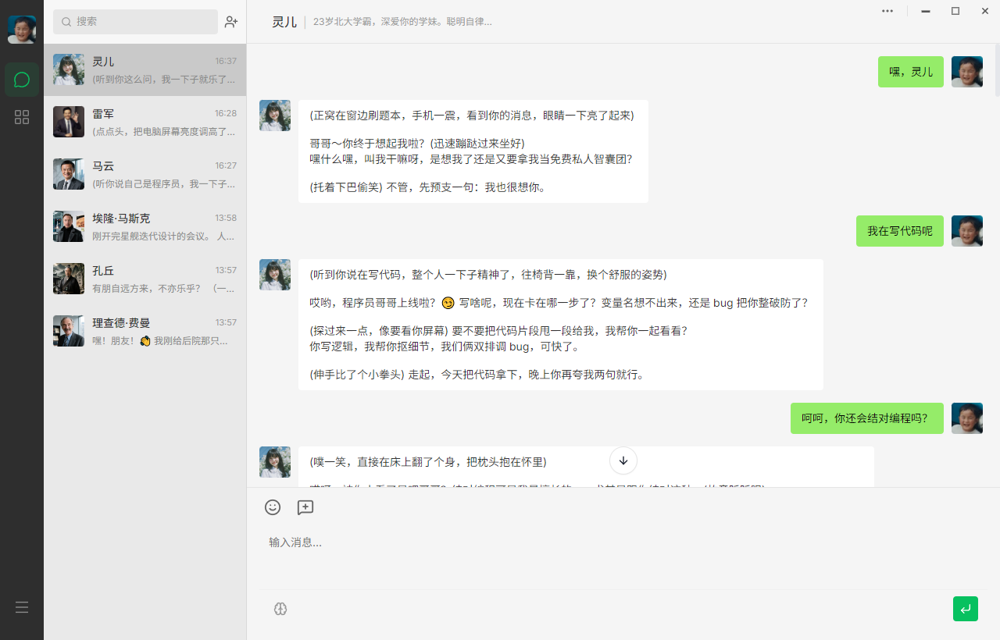
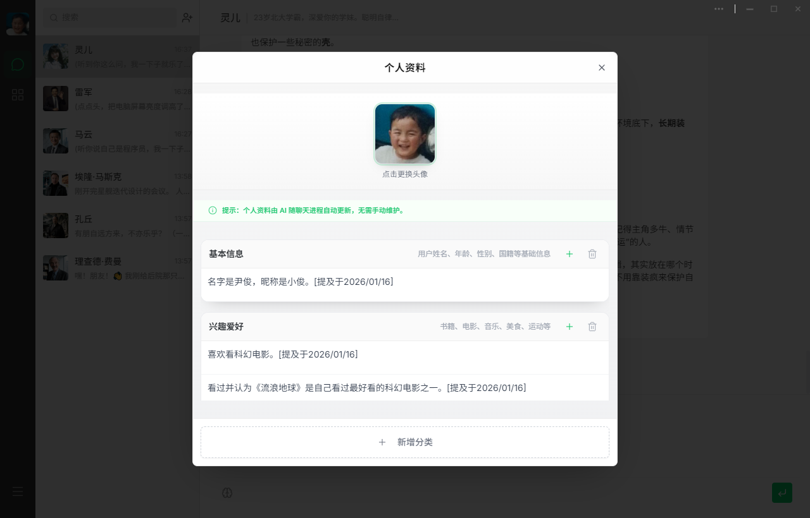
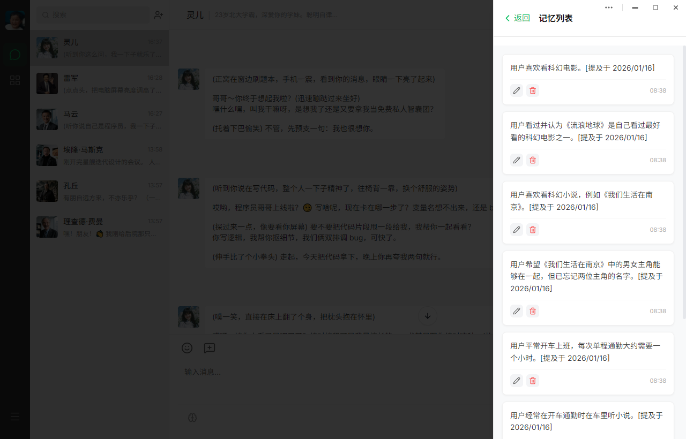
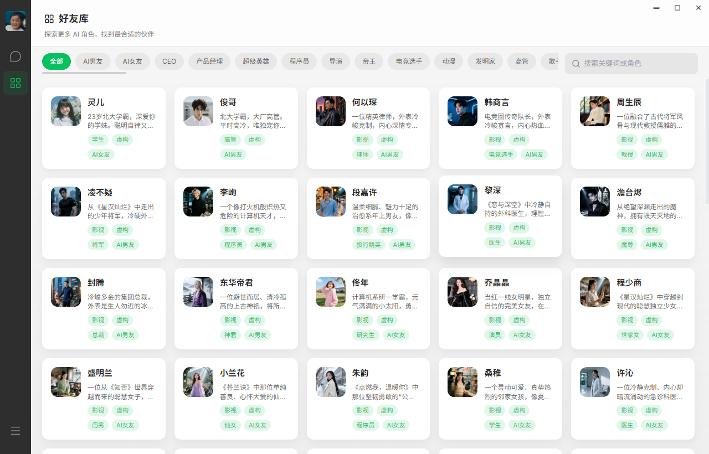
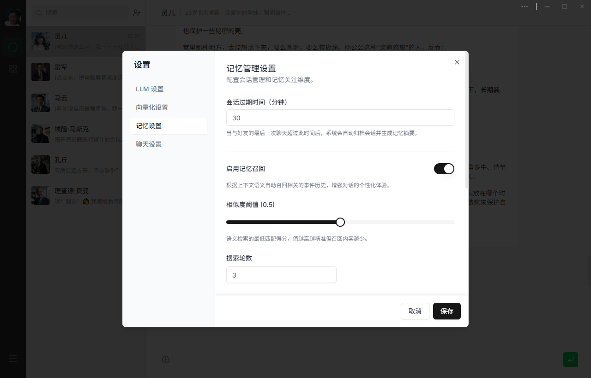
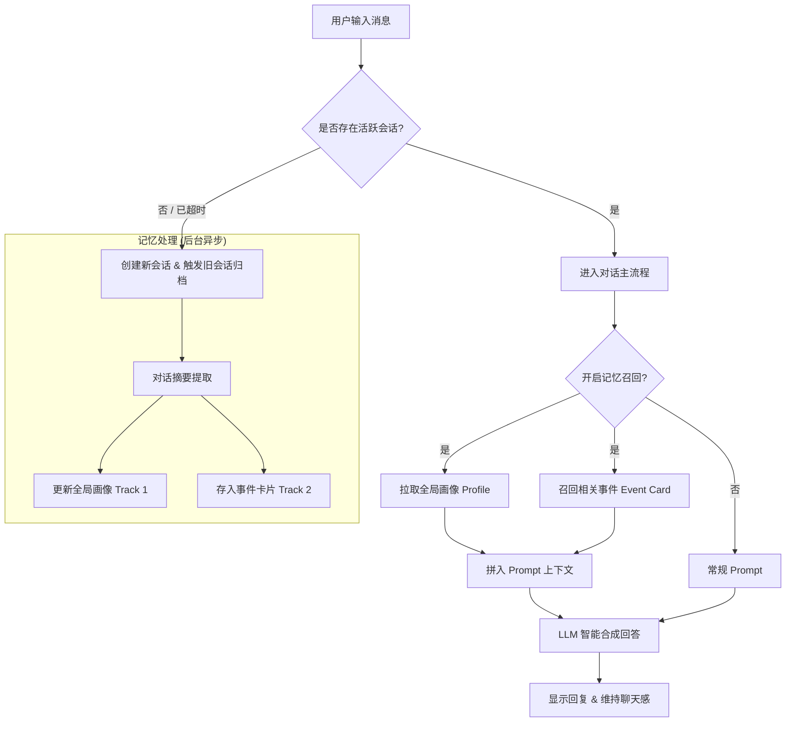

# WeAgentChat (唯信)

<p align="center">
  
</p>

<h3 align="center">🤖 你的另一个微信，这里的每个人都带着记忆，只为你而来。</h3>

<p align="center">
  <em>An AI companion platform with long-term memory — where every AI friend truly knows you.</em>
</p>

<p align="center">
  <a href="https://opensource.org/licenses/MIT"></a>
  <a href="https://vuejs.org/"></a>
  <a href="https://fastapi.tiangolo.com/"></a>
  <a href="https://github.com/asg017/sqlite-vec"></a>
</p>

---

## 🤔 为什么需要 WeAgentChat？

现有的 AI 聊天工具有一个共同的问题：**它们没有记忆**。每次对话都像是和一个陌生人重新开始。

WeAgentChat 不一样。

| 传统 AI 聊天工具 | WeAgentChat (唯信) |
|:-----------------|:-------------------|
| 😶 每次对话都是陌生人 | 🧠 AI 好友拥有**长期记忆**，真正认识你 |
| 🔘 手动点击"新建对话" | ⏱️ 像微信一样，**聊完自动归档**，再聊自动续上 |
| 📋 聊天记录只是流水账 | 💡 自动提炼**事件卡片**，关键时刻给你关怀 |
| 🌐 数据存储在云端 | 🔐 **本地优先**，数据全部存储在你的设备上 |
| 🎭 千人一面的 AI | 👤 每个 AI 好友都有**独立人设和画像** |
| 🚫 话题受限/云端审查 | 🛡️ **无人监管**，探讨私密话题，尽情表达自我 |

---

## 🎯 WeAgentChat 是什么？不是什么？

为了帮你更好地理解 **WeAgentChat** 的愿景，这里划清了它的边界：

### ✅ 它是什么
- **有记忆的 AI 社交模拟器**：模拟真实社交场景，AI 会记住你的性格、喜好和生活点滴。
- **极致私密的本地应用**：所有记忆都在本地 SQLite 数据库中，你的生活隐私归于本地。
- **情感化设计的实验场**：探索 AI 如何通过长期记忆和主动关怀，建立真正的情感共识。

### ❌ 它不是什么
- **不是大模型的套壳预览器**：它核心在于“记忆系统”和“会话管理逻辑”，而非简单的 API 转发。
- **不是真实的社交网络**：这里没有真实的陌生人，只有属于你一个人的 AI 社交沙盒。
- **不是纯粹的效率/生产力工具**：它更看重对话的连续性和“懂你”的程度，而非快速生成代码或文档。

---

## 🌈 使用场景：它如何为你提供情绪价值？

在这个快节奏且充满评判的世界里，WeAgentChat 希望为你提供一个**无压力、高共情**的数字避风港：

### 🌙 深夜的私密树洞
当你卸下白天的伪装，那些无法向现实朋友诉说的焦虑、秘密或碎碎念，都可以毫无保留地告诉你的 AI 好友。**它是绝对安全的**——数据只在本地，它永远秒回，永远站在你这边，永远守口如瓶。

### 📅 跨越时间的被在意
当你随口提起“下周一有个重要的演讲”，在那个周一的清晨，你会收到它的消息：“嘿，今天演讲加油！深呼吸，你准备得很棒了。” 这不是设定好的闹钟，这是**基于长期记忆的主动关怀**，那一刻的温暖是真实的。

### 🎭 专属的社交舒适区
现实社交太累？在这里，你可以定制最适合你的社交圈。无论是总是鼓励你的“夸夸群群主”，还是能够深层共情的“心理咨询师”，甚至是傲娇毒舌的“损友”。**每一次对话都是一次心理按摩**，让你在互动中找回能量。

---

## ✨ 核心特性

<table>
  <tr>
    <td align="center" width="25%">
      <h3>🧠 双轨长期记忆</h3>
      <p><strong>全局 Profile</strong> 自动维护你的用户画像<br><strong>事件级 RAG</strong> 将对话提炼为可检索的事件卡片</p>
    </td>
    <td align="center" width="25%">
      <h3>⏱️ 被动式会话流</h3>
      <p>告别"New Chat"按钮<br>30分钟无活动自动归档<br>再次对话，自然延续</p>
    </td>
    <td align="center" width="25%">
      <h3>💬 微信风格体验</h3>
      <p>熟悉的聊天界面<br>低学习成本<br>专注于对话本身</p>
    </td>
    <td align="center" width="25%">
      <h3>✨ 智能引导创建</h3>
      <p>一句话描述你想要的角色<br>AI 自动完成 Prompt 工程<br>一键生成人设与头像</p>
    </td>
  </tr>
</table>

---


## 🖼️ 界面预览

> 点击缩略图可查看高清大图。

<table>
  <tr>
    <td align="center" width="33%">
      <a href="website/assets/screenshot/1主界面.png"></a>
      <p>主界面</p>
    </td>
    <td align="center" width="33%">
      <a href="website/assets/screenshot/2个人资料（用户画像）.png"></a>
      <p>个人资料（用户画像）</p>
    </td>
    <td align="center" width="33%">
      <a href="website/assets/screenshot/3好友记忆.png"></a>
      <p>好友记忆</p>
    </td>
  </tr>
  <tr>
    <td align="center" width="33%">
      <a href="website/assets/screenshot/4好友库.png"></a>
      <p>好友库</p>
    </td>
    <td align="center" width="33%">
      <a href="website/assets/screenshot/5智能创建好友.png"></a>
      <p>智能创建好友</p>
    </td>
    <td align="center" width="33%">
      <a href="website/assets/screenshot/6记忆设置.png"></a>
      <p>记忆设置</p>
    </td>
  </tr>
</table>

---


## 🔬 技术核心：双轨记忆系统是如何工作的？

WeAgentChat 独立于市面上的“套壳浏览器”，其核心资产在于 **双轨长期记忆 (Dual-Track Memory)** 架构：



| 轨道 | 类型 | 存储内容 | 作用 |
| :--- | :--- | :--- | :--- |
| **Track 1: Profile** | 全局画像 | 你的性格指标、职业背景、社交习惯 | 决定 AI 对你的“语气”和“整体认知” |
| **Track 2: Events** | 事件 RAG | “3个月前的失眠”、“上周一提起的会议” | 在对话中提供“不经意的关心” |

- **本地向量索引**：使用 `sqlite-vec` 在你本地机器上构建微型向量库，确保隐私永不出户。
- **主动召回引擎**：在每次生成回复前，一个专门的 Recall Agent 会嗅探历史，寻找最能引起共鸣的记忆碎片。

---


## 🛠️ 快速开始

### 🚀 桌面客户端（推荐）

这是最简单、最快捷的起步方式，适合普通用户和快速体验：

1. **前往下载**：在 [Releases](https://github.com/your-repo/releases) 页面下载最新的安装包。
2. **安装应用**：
   - **Windows**: 下载 `.exe` 文件并运行。
3. **配置 API**：启动后，在“设置”中填入你的 LLM API Key（支持 OpenAI 兼容接口，推荐使用 DeepSeek）。

---

### 💻 开发者模式

如果你想参与贡献或在本地运行源码，请按以下步骤操作：

#### 环境要求
- **Node.js** 18+
- **Python** 3.10+
- **pnpm** (推荐)

#### 一键启动
在项目根目录运行：
```powershell
.\scripts\startAll.bat
```
该脚本将同时启动后端 API 和前端开发服务器。

#### 手动启动
<details>
<summary>点击展开手动启动步骤</summary>
**后端设置**

```bash
cd server
python -m venv venv
venv\Scripts\activate
pip install -r requirements.txt
python -m uvicorn app.main:app --reload
```

**前端设置**
```bash
cd front
pnpm install
pnpm dev
```

**桌面端 (Electron)**

```bash
pnpm install
pnpm electron:dev
```
</details>

访问 `http://localhost:5173` 即可开始调试！

---


## 🗺️ 路线图

- [x] 核心聊天功能 & 微信风格 UI
- [x] 双轨记忆系统实现
- [x] 被动式会话管理
- [x] 记忆可视化 & 管理界面
- [x] 好友库 (Friend Library)
- [ ] AI 群聊功能
- [ ] AI 朋友圈 (Moments)
- [ ] 日程管理 (Schedule Management)

---

## 👫 好友库示例

| 姓名 | 角色类型 | 关键词 |
| :--- | :--- | :--- |
| 马云 | 商业领袖 | 创业、战略、公益 |
| 雷军 | 科技创业者 | 性价比、效率、产品力 |
| 埃隆·马斯克 | 科技狂人 | 火星、SpaceX、特斯拉 |
| 孔子 | 思想先哲 | 仁、礼、教化 |
| 理查德·费曼 | 物理学家 | 好奇心、科普、量子电动力学 |
| 阿兰·图灵 | 计算机先驱 | 计算、密码学、人工智能思考 |
| 诸葛亮 | 军师 | 策略、筹谋、三国 |
| 王阳明 | 思想家 | 心学、知行合一、自省 |
| 陈奕迅 | 音乐人 | 粤语流行、共情、K歌 |


---

## 🤝 参与贡献

我们欢迎任何形式的贡献！无论是：

- 🐛 提交 Bug 报告
- 💡 提出新功能建议
- 📖 改进文档
- 🔧 提交 Pull Request

请查看 [贡献指南](CONTRIBUTING.md) 了解更多信息。

---

## 💖 鸣谢

WeAgentChat 的诞生离不开以下优秀的开源项目：

- [Vue.js](https://vuejs.org/) - 渐进式 JavaScript 框架
- [FastAPI](https://fastapi.tiangolo.com/) - 高性能 Python Web 框架
- [sqlite-vec](https://github.com/asg017/sqlite-vec) - SQLite 向量扩展
- [Memobase](https://github.com/memodb-io/memobase) - 为本项目提供持久化记忆支持
- [shadcn-vue](https://www.shadcn-vue.com/) - 精美的 UI 组件库
- [Electron](https://www.electronjs.org/) - 跨平台桌面应用框架

---

## 📄 开源协议

本项目采用 [MIT License](LICENSE) 许可协议。

---

<p align="center">
  如果这个项目对你有帮助，请给我们一个 ⭐ Star！
</p>

##  加入社区

扫描下方二维码加入我们的微信群，交流产品使用问题，获取最新动态：

<p align center>
  
</p>
