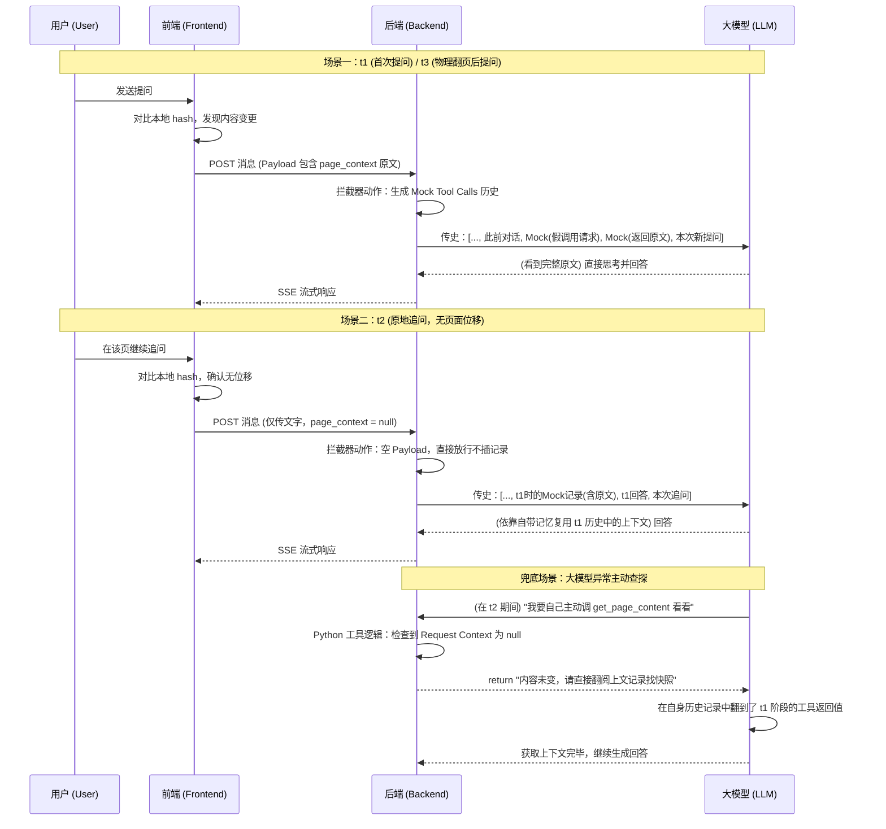

# 伴读助手：基于 Mock Tool Calls 的上下文按需注入方案

## 1. 背景与核心痛点
当前"与作者共读"功能采用将书籍正文和选中文字直接注入 `System Prompt` 的方式。虽然实现简单，但存在以下缺陷：
*   **极其浪费 Token**：在多轮聊天中，如果用户停留在同一页讨论同一个问题，这几千字的页面内容会在每一次请求中重复传输给 LLM。这不仅极大浪费了 Token，还会稀释 Prompt，影响 AI 的指令遵循。

## 2. 核心解决思路：伪造工具调用 (Mock Tool Calls Injection)
为了彻底解决长文本重复传输的问题，我们将采用**"在消息历史中伪造大模型主动获取上下文记录"**的策略。这不仅比纯粹注册真实 Tools 让 AI 自己去触发更高效，更能完美利用大模型的对话记忆模型。

### 核心场景机理演绎：
与其让大模型自己去决定"要不要调用工具获取当前页"（这需要耗费额外的网络 Round-trip 时间），不如后端直接**帮它把工具跑完，并把调用结果伪造成历史记录，强行塞入对话上下文中**。

#### t1: 初次提问 / 翻到新的一页
*   **触发**：用户在第 A 页选中了文字"a"并发送了消息。
*   **前端动作**：前端检测到这是首次发问（或内容发生了变更），将 `page_context` 和 `selected_quote` 的完整文本放入请求 Payload。
*   **后端动作**：后端发现请求体里包含 `page_context` 和 `selected_quote`，在发给 LLM 的对话历史中，强行在用户消息前插入"假记录"（Mock Tool Calls）：
    1.  **[assistant tool_call]**：请求调用 `get_page_content`。
    2.  **[tool result]**：第 A 页的正文内容。
    3.  **[assistant tool_call]**：请求调用 `get_selected_content`。
    4.  **[tool result]**：文字"a"。
*   **LLM 视角**："我刚好已经调用工具获取到了这些信息，现在可以完美解答用户的疑问了。"

#### t2: 停留在原页继续追问
*   **触发**：用户还在 A 页，选中文字依然是"a"，继续发送追问消息。
*   **前端动作**：前端对比本地 hash，发现页面和选中内容均未变化，于是**不传** `page_context` 和 `selected_quote`（设为 null 或不带该字段）。
*   **后端动作**：后端发现请求体里没有这两个字段，**什么也不做，直接放行**。不插入任何新的 Mock 记录。
*   **LLM 视角**：读取原生对话历史时，它自然能追溯到 t1 时刻自己"查出来"的页面 A 的内容储备，基于自带记忆无缝继续作答。**（达到 100% 完美的 Token 局部去重！）**

#### t3: 翻页后提问
*   **触发**：用户翻到了全新的一页 B，选中了文字"b"。
*   **前端动作**：前端对比本地 hash，发现发生了变化，于是将全新的 `page_context`（B 页内容）和 `selected_quote`（文字"b"）放入请求 Payload，并更新本地 hash。
*   **后端动作**：后端发现请求体携带了数据，再次如同 t1 那样，在对话历史的最末端，重新塞入全新的 Mock 记录。
*   **LLM 视角**：看到最新的工具返回结果，大模型会自动把注意力焦点从 A 切换到最新获得的 B 页上下文上。

#### 边界场景：用户取消选中文字
*   **触发**：用户之前选中了文字"a"，现在取消了选中（没有选中任何文字），但页面没变。
*   **前端动作**：前端检测到 `quote_hash` 从有值变成了空值（视为变化），仅传 `selected_quote = ""`（空字符串或特殊标记），`page_context` 不传（因为页面没变）。
*   **后端动作**：后端只为 `get_selected_content` 插入一条 Mock 记录，内容为"用户当前未选中任何文字"。不插入 `get_page_content` 的 Mock。

---

## 3. 工具生态分类 (MCP 接口化)
我们将注册并在后端统一归口管理以下两类工具：

### 3.1 真工具 (由 LLM 主动触发)

| 工具名称 | 职责描述 | 数据来源 |
| :--- | :--- | :--- |
| `grep_book_search` | 根据关键词在整本书中搜索，返回匹配片段及前后上下文。 | 后端读取已解析的电子书全文，进行文本匹配。 |
| `get_book_toc` | 获取书籍目录结构（TOC），帮助 AI 了解章节层级。 | 后端从 `books` 表的 `toc_data` 字段读取。 |

> 这两个工具赋予了 AI "跳出当前页面视野"的全局探索能力，如跨章节搜索、引用其他段落等。

### 3.2 伪造工具 (由后端静态拦截注入 / 兜底响应)

| 工具名称 | 职责描述 | 数据来源 |
| :--- | :--- | :--- |
| `get_selected_content` | 承载用户当前正选中的文字片段。 | 前端随请求上报的快照。 |
| `get_page_content` | 承载用户当前正在阅读的页面内容。 | 前端随请求上报的快照。 |

> 这两个工具通常通过 Mock 注入使用。但也作为真实工具注册，以应对大模型的主动调用（兜底逻辑见下文第 4.4 节）。

---

## 4. 前端驱动的无状态后端架构
**核心原则：让产生状态的地方管理状态。坚决拒绝在后端使用全局内存变量保存快照。**

后端本身应当保持 RESTful 的绝对无状态特性，不需要去记忆"这具会话上次看的是哪一页"，更不应该保存任何关于阅读状态的全局变量。一切变动的判定权完全下放给**前端**，上下文的长期记忆完全交给**大模型自身（通过携带的历史记录）**。

### 4.1 精简前端 Payload
在 `BookReadingMessageCreate` 结构中，`page_context` 和 `selected_quote` 设置为可选字段 (Optional)。

### 4.2 前端判定与发送
*   前端维护当前的 `page_hash` 和 `quote_hash`。在发送消息时对比本地状态。
*   **如果没变（t2 场景）**：前端直接将这两个字段传 `null`（或者不传），极大节省请求带宽。
*   **如果变了（t1、t3 场景）**：前端将全量文本作为 payload 传给后端，并更新本地 hash。
*   **如果选中取消了**：前端传 `selected_quote = ""`，标识"用户当前无选中"。

### 4.3 Mock 注入拦截器 (极简拦截)
*   只要请求体里带有 `page_context` 或 `selected_quote` 数据，后端就在向 Agent 发送前，强行 Append 伪造的工具调用历史记录。
*   如果请求体为空（前端没传），后端直接放行，不添加任何假记录。

### 4.4 兜底防抽风：后端工具的无状态实现
*   **问题**：如果前端没传页面内容（t2 场景），但大模型偏要自己主动调用一次 `get_page_content` 工具，后端手里没有快照怎么回？
*   **解法**：在后端注册的真实工具函数中，使用请求级闭包（Request-Scoped Closure）。当该次请求没带 `page_context` 时，工具直接返回固定引导语：
    ```
    "页面内容未发生任何变动。请直接向上查阅此前的对话历史记录，内含你最近一次获取且仍有效的完整内容快照。"
    ```
*   **效果**：大模型收到这句话，自然会回头翻阅自身携带的历史记录，并最终找到上次 Mock 时注入的长文本，顺理成章地继续回答。全程后端不持有一丝状态！

### 4.5 Mock 消息的数据格式
伪造的工具调用记录需符合 OpenAI Agents SDK 的消息格式规范。在组装 `agent_messages` 列表时，插入以下结构：

```python
# 伪造 assistant 发起工具调用
{"role": "assistant", "tool_calls": [
    {"id": "mock_page_001", "type": "function",
     "function": {"name": "get_page_content", "arguments": "{}"}}
]}
# 伪造工具返回结果
{"role": "tool", "tool_call_id": "mock_page_001",
 "content": "【第 A 页正文内容...】"}
```

---

## 5. 交互时序图

下面是基于不同场景下，各端交互状态及大模型历史流转的序列图：



---

## 6. 预期收益总结
*   **零网络 Round-Trip 延迟**：由后端直接"填喂"上下文历史，无需等大模型深思熟虑决定去调工具后再等待二次回调，彻底消灭额外网络花销。
*   **Token 费率"仅随物理位移计费"**：用户在单页停留阅读并抛出 100 轮连续提问时，再也不会重复计费这页的上下文。极致实现了前端交互行为与生成式大语言模型底层原理的最佳结合。
*   **后端彻底无状态**：不保存任何全局变量或会话级缓存，所有状态判定归前端，上下文记忆归大模型历史。架构干净、可扩展。
