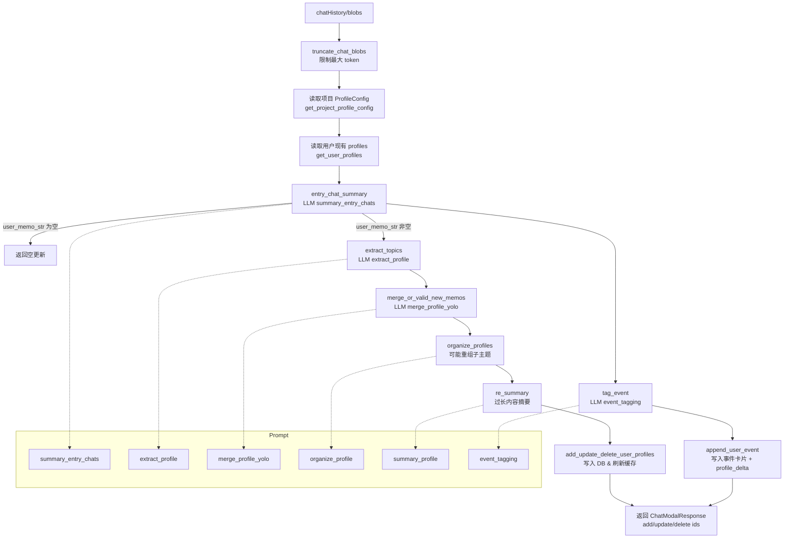

# chatHistory -> profile 处理流程（Memobase）

## 示例（从 chatHistory 到 profile 全流程）

**输入 chatHistory（blobs）**  
- 用户：我最近总是凌晨 2 点才睡，白天困得不行。  
- 朋友A：那你最近加班多吗？  
- 用户：是的，连续两周都在加班。  
- 用户：顺便，我喜欢黑咖啡，不加糖。  

**步骤与输出（简化示意）**  
1) `truncate_chat_blobs`  
   - 作用：按 `CONFIG.max_chat_blob_buffer_process_token_size` 从末尾截断 chatHistory  
   - 条件：若截断后为空，直接报错返回（`No blobs to process after truncating`）  
   - 结果：保留最近一段对话（总 token 未超限）。  

2) `entry_chat_summary`（prompt: `summary_entry_chats`）  
   - 作用：把 chatHistory 压缩成结构化“事件摘要”，并融合已有 profile 语境  
   - 输入：对话 + 当前已有 profile + 项目 profile 槽位  
   - 条件：若返回的 `user_memo_str` 为空，直接返回空更新（不再进入后续流程）  
   - 输出 `user_memo_str`（示例）：  
     - “用户近期长期加班，作息晚睡；偏好饮品为黑咖啡不加糖。”  

3) `extract_topics`（prompt: `extract_profile`）  
   - 作用：从摘要里抽取“可落到 profile 槽位的事实”（topic/subtopic/memo）  
   - 输入：`user_memo_str` + profile 槽位  
   - 条件：  
     - 若解析不到任何新事实，直接返回空的 `fact_contents/fact_attributes`  
     - 若开启 profile 槽位限制（`allowed_topic_subtopics`），不在允许范围内的事实会被丢弃  
   - 输出 facts（示例）：  
     - topic=生活习惯 / sub_topic=作息 / memo=“近期常凌晨2点才睡，白天困”  
     - topic=工作状态 / sub_topic=加班频率 / memo=“连续两周加班”  
     - topic=饮食偏好 / sub_topic=咖啡偏好 / memo=“喜欢黑咖啡不加糖”  

4) `merge_or_valid_new_memos`（prompt: `merge_profile_yolo`）  
   - 作用：决定每条事实与现有 profile 的合并动作（UPDATE/APPEND/ABORT）  
   - 输入：facts + 当前 profiles  
   - 条件：  
     - 若 `profile_validate_mode` 关闭且该槽位 `validate_value` 为 false 且无现存 profile，则跳过 LLM 校验，直接 ADD  
     - LLM 结果解析失败会记录日志并跳过对应条目（或返回错误）  
   - 输出动作（示例）：  
     - UPDATE：将“作息”内容更新为更明确的“近期常凌晨2点才睡”  
     - APPEND：在“加班频率”现有内容后追加“连续两周”  
     - ADD：新增“咖啡偏好=黑咖啡不加糖”  

5) `organize_profiles`（prompt: `organize_profile`）  
   - 作用：当某个 topic 子主题过多时，进行聚合/重命名/归并  
   - 条件：只有当同一 topic 的子主题数量 `> CONFIG.max_profile_subtopics` 才会触发重组  
   - 若某 topic 子主题过多，则合并/重组（此例无变化）。  

6) `re_summary`（prompt: `summary_profile`）  
   - 作用：对过长的 profile 内容做压缩摘要，保证 token 限制  
   - 条件：仅当单条 memo 的 token 数 `> CONFIG.max_pre_profile_token_size` 才会摘要  
   - 若单条 memo 太长则摘要（此例无变化）。  

7) `add_update_delete_user_profiles`  
   - 写入 DB，刷新缓存。  
   - 返回 `add/update/delete` 的 profile ids。  

8) `tag_event`（prompt: `event_tagging`）  
   - 作用：从事件摘要中抽取标准化标签，便于事件检索/回忆  
   - 条件：始终执行，但 LLM 失败会记录日志，可能返回空标签  
   - 事件标签（示例）：  
     - “作息异常”、“工作压力”、“饮食偏好”  
   - `append_user_event` 写入事件卡片，并记录 `profile_delta`。  
